# Abstract

Pedestrian heat exposure is a critical health risk in dense tropical cities, yet standard routing algorithms often ignore micro-scale thermal variation. Hot Hẻm is a GeoAI workflow that estimates and operationalizes pedestrian heat exposure in Hồ Chí Minh City (HCMC), Việt Nam, colloquially known as Sài Gòn. This spatial data science pipeline combines Google Street View (GSV) imagery, semantic image segmentation, and remote sensing. Two XGBoost models are trained to predict land surface temperature (LST) using a GSV training dataset in selected administrative wards, known as phường, and are deployed in a patchwork manner across all OSMnx-derived pedestrian network nodes to enable heat-aware routing. This is a model that, when deployed, can provide a foundation for *pinpointing where* and further *understanding why* certain city corridors may experience disproportionately higher temperatures at an infrastructural scale.

# I. Introduction

Given that urban heat and other environmental injustices are widely recognized as being disproportionately felt (Chakraborty et al., 2019), dangerous heat exposure will only continue to exacerbate with growing populations and current pollution trajectories. Extreme heat is heterogeneous and driven by both macro-scale morphologies (e.g. elevation, land cover, surface emissivity) and micro-scale streetscapes (e.g. building canyon effects, tree canopy, visible sky) (Oke, 1982), many of which are influenced by local municipalities' regulations on the built environment and social structures.

Conventional thermal mapping often emphasizes satellite-derived patterns that could underrepresent pedestrian-scale experiences (Middel et al., 2019), and some existing literature notes shaded routes can significantly improve pedestrian comfort. However, there is lacking emphasis that the onus falls on local municipalities to provide resilient, cool, and green infrastructure—this is a byproduct communicated by shade-finding algorithms that present coolest routes. Regardless of intention, they present as alternatives rather than tools to assist with building solutions, implying health, wellbeing, and heat-stress mitigation is a choice among locals, and not a prevailing systemic and infrastructural issue that will worsen with global warming.

This project aims to fill these gaps by firstly, fusing street-level visual morphology with thermal and structural remote-sensing predictors, and secondly, by seeking the hottest routes as a government tool. This is where machine learning (ML) optimization can recommend routes *minimizing shade* and *maximizing sun exposure*, revealing the hottest paths as potential candidates for shaded infrastructure, future tree canopies, or further investigation, demonstrating how ML can help enhance urban resilience to extreme heat.

# II. Data and Study Area

## Pedestrian Network and Wards

A pedestrian network graph with a 500-meter buffer was extracted from Python's `osmnx` (Boeing, 2017), yielding 28,445 nodes and 74,710 edges for three administrative districts: District 1, District 2, and District 8. Due to API costs and keeping in mind computational efficiency, only six wards were selected as disparate GSV candidates, two from each district of interest: Bến Thành (2,424 nodes) and Cô Giang (1,840 nodes) in District 1, An Khánh (1,119 nodes) and Thảo Điền (1,547) in District 2, and Phường 5 (2,346 nodes) and Phường 6 (2,013 nodes) from District 8.

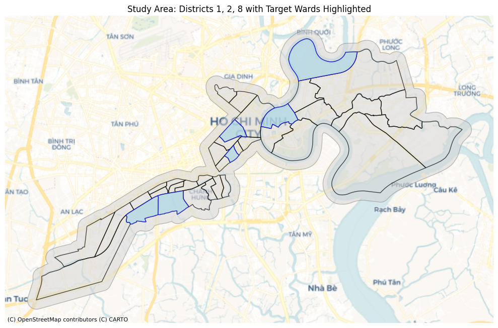

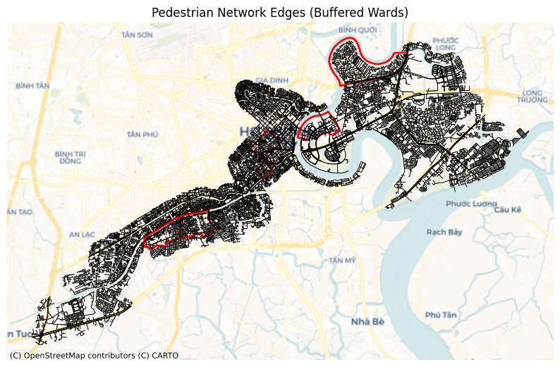

## Street-Level Imagery

GSV samples generated 23,806 points from 500-meter buffered wards of interest at 50-meter intervals. Metadata contained 20,457 images, an unfortunate 14.07% decrease due to interruptions, but nonetheless providing sufficient density for training streetscape indices and validating segmentation outputs within wards of interest.

## Remote Sensing Rasters

The satellite data was extracted from several different sources (USGS, 2024; Shimada et al., 2014):

**Landsat 8 / 9 (30m resolution, dry months December thru April, 2023–2025)**

-   LST ST_B10 Band

-   Emissivity ST_EMIS Band

-   Red SR_B4 Band

-   Near Infrared (NIR) SR_B5 Band

-   QA_PIXEL Band

**JAXA LULC (10m resolution, 2025)**

-   Land Cover

**JAXA PALSAR-2 (ScanSAR, 50m resolution, 2025)**

-   HH Polarization

-   HV Polarization

-   Observation Date / Time

-   Local Incidence Angle

-   Mask / Flag

**ALOS World 3D DSM (30m resolution, 2025)**

-   Elevation

-   Mask

-   Stacking Number

# III. Methodologies

In the interest of computational efficiency, all notebooks and scripting were offloaded from local into cloud computing using Google's Colab Pro with A100 GPU acceleration. Combining Landsat rasters into a composite was completed in ArcGIS v3.4.

## Image Segmentation and Superclass Mapping

GSV images were processed using Mask2Former Swin-Large (Cheng et al., 2022) trained on Mapillary Vistas (`facebook/mask2former-swin-large-mapillary-vistas-semantic`) (Neuhold et al., 2017), accessed via Hugging Face. The model contains 65 object categories optimized for street-level scene analysis in complex urban environments like Sài Gòn.

GSV images were downloaded at 640 × 640 pixel resolution. Ideally, panoramic images would have been preferable, but due to cost restraints, the static imagery was made to dynamically alter the header to be front-facing.

To improve interpretability and stability for index construction, raw segmentation classes were remapped into seven superclasses:

| Mapping | Superclass               |
|---------|--------------------------|
| 0       | Other                    |
| 1       | Vegetation               |
| 2       | Sky                      |
| 3       | Building                 |
| 4       | Pavement / Road          |
| 5       | Water                    |
| 6       | Vehicle / Street Clutter |

: Superclass Mappings

The mapping aggregates the 65 Mapillary Vistas classes as follows: Other (23 classes including persons, animals, terrain, street furniture), Vegetation (1 class), Sky (1 class), Building (7 classes including walls, fences, bridges, tunnels), Pavement/Road (12 classes including sidewalks, bike lanes, parking), Water (2 classes including boats), and Vehicle/Clutter (16 classes including poles, signs, vehicles).

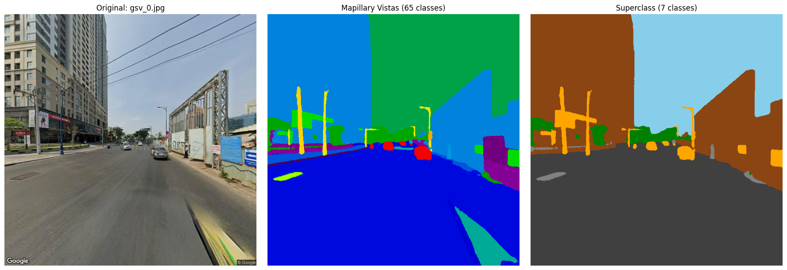

## Engineering Indices

The final merged superclass imagery was used to create predictive features (Li et al., 2015). Seven superclass percentages were computed directly from the segmentation masks:

-   `pct_vegetation`: Proportion of vegetation pixels

-   `pct_sky`: Proportion of sky pixels

-   `pct_building`: Proportion of building pixels

-   `pct_pavement_road`: Proportion of pavement/road pixels

-   `pct_water`: Proportion of water pixels

-   `pct_vehicle_clutter`: Proportion of vehicle/clutter pixels

-   `pct_other`: Proportion of other pixels

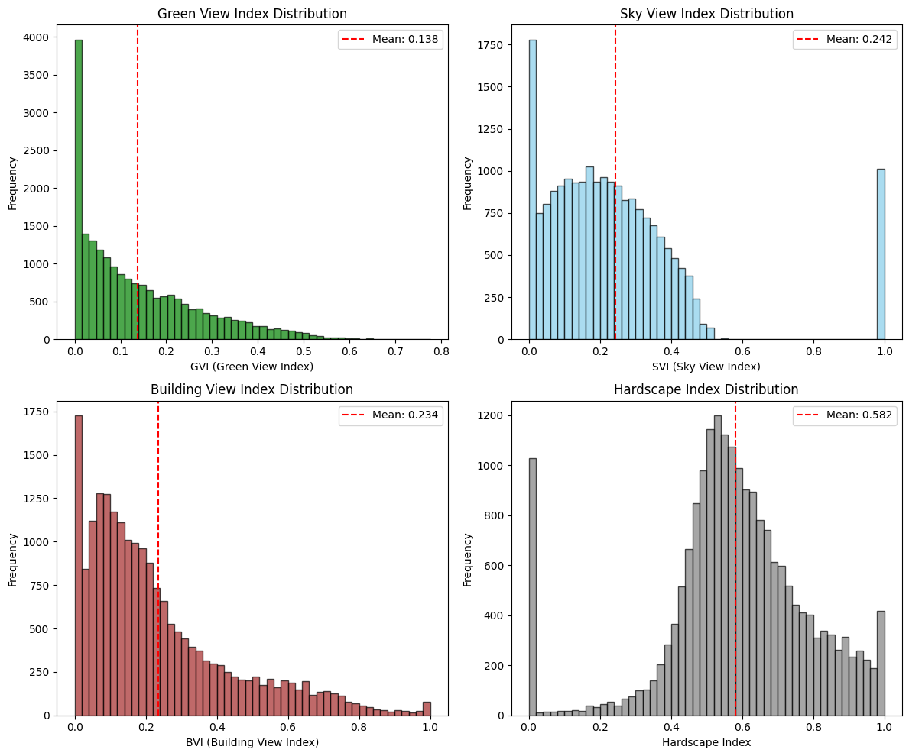

## Raster Extraction

The collection of Landsat rasters moved through the below workflow in this order:

1.  Create Mosaic Dataset (Data Management)
2.  Make Mosaic Layer (Data Management)
3.  Cell Statistics (Spatial Analyst)
4.  Raster Calculator (Spatial Analyst)
5.  Copy Raster (Data Management)
6.  Composite Bands (Data Management)

A mosaic dataset was created to combine and stitch together 64 scenes from 2023 thru 2025 during dry season months December thru April.

The different mosaic layers were isolated, with maximum LST and averages for other layers. This was to process individual cell statistics to convert DN raw values and re-scale, and raster calculations to calculate NDVI and alter LST from Kelvin to Celsius. Only the QA_PIXEL band was acquired through the 5th tool.

Two extraction products were used for the rasters, one for the GSV sample points and second for the entire network nodes. All raster values were extracted for all nodes except for LST, where 0.0037% of nodes were unaccounted for, decreasing from 28,437 to 28,332 nodes.

## Model Design and Training

Two XGBoost models were trained using the `xgboost` Python library: a full model including raster and GSV features for maximum predictive power, and a deployment model using only raster features for city-wide application (Chen & Guestrin, 2016).

``` python
# Landsat features: thermal and vegetation indices.
LANDSAT_FEATURES = [
    "ndvi",
    "emissivity"
]

# PALSAR features: radar backscatter and texture.
PALSAR_FEATURES = [
    "palsar_hh_db",
    "palsar_hv_db",
    "palsar_hv_hh_ratio",
    "palsar_glcm_contrast",
    "palsar_glcm_homogeneity",
    "palsar_glcm_energy"
]

# DSM features: elevation and sky view.
DSM_FEATURES = [
    "elevation_m",
    "sky_view_factor"
]

# Landcover features.
LANDCOVER_FEATURES = [
    "landcover_class"
]

# GSV segmentation features: direct superclass percentages.
GSV_SEGMENTATION_FEATURES = [
    "pct_vegetation",
    "pct_sky",
    "pct_building",
    "pct_pavement_road",
    "pct_water",
    "pct_vehicle_clutter",
    "pct_other"
]
```

## Feature Selection Rationale

Each predictor variable was selected based on its established physical or empirical relationship with land surface temperature:

**Landsat-Derived Features:**

-   `ndvi`: The Normalized Difference Vegetation Index quantifies vegetation density. Higher NDVI indicates greater evapotranspiration and shading capacity, which reduces surface temperatures (USGS, 2024).

-   `emissivity`: Surface emissivity determines how efficiently a material radiates absorbed thermal energy. Urban materials (e.g. concrete, asphalt) typically have lower emissivity than vegetated surfaces, affecting the LST retrieval and thermal behavior.

**PALSAR-2 Radar Features:**

-   `palsar_hh_db` and `palsar_hv_db`: SAR backscatter intensity in HH and HV polarizations captures surface roughness and structural characteristics. Built-up areas with vertical structures produce stronger backscatter, serving as proxies for urban density and building mass that store and re-emit heat.

-   `palsar_hv_hh_ratio`: The cross-polarization ratio distinguishes vegetation (higher HV response due to volume scattering) from built surfaces (dominated by HH) (Shimada et al., 2014), providing structural information complementary to optical indices.

-   `palsar_glcm_contrast`, `palsar_glcm_homogeneity`, `palsar_glcm_energy`: Gray-Level Co-occurrence Matrix (GLCM) texture metrics characterize spatial heterogeneity of the urban fabric. High contrast indicates fragmented land cover; homogeneity captures uniformity of surface types—both relate to thermal variability patterns.

**DSM-Derived Features:**

-   `elevation_m`: Elevation influences temperature through adiabatic lapse rates and drainage patterns. Lower elevations in HCMC often correspond to denser development and reduced ventilation.

-   `sky_view_factor`: SVF measures the proportion of visible sky hemisphere from a point, approximating urban canyon geometry. Lower SVF indicates taller surrounding structures that trap longwave radiation and reduce nocturnal cooling.

**Land Cover:**

-   `landcover_class`: Categorical land use classification directly encodes surface type (water, forest, urban, agriculture), each with distinct thermal properties, albedo, and heat capacity.

**GSV-Derived Streetscape Features:**

-   `pct_vegetation`: Street-level vegetation proportion captures micro-scale canopy cover invisible to 30m satellite imagery, directly measuring shade availability at pedestrian height.

-   `pct_sky`: Visible sky proportion from street level indicates canyon openness and potential solar exposure—complementing the DSM-derived SVF with human-perspective geometry.

-   `pct_building`: Building facade proportion quantifies wall surfaces that absorb and re-radiate heat, contributing to the urban heat island effect at street scale.

-   `pct_pavement_road`: Impervious surface proportion at street level captures heat-absorbing materials with low albedo and no evaporative cooling capacity.

-   `pct_water`: Water body visibility indicates proximity to cooling features; water has high heat capacity and provides evaporative cooling.

-   `pct_vehicle_clutter`: Vehicle and street furniture proportion serves as a proxy for traffic density and anthropogenic heat sources.

-   `pct_other`: Remaining categories (persons, terrain, miscellaneous objects) provide contextual information about street activity and surface conditions.

The XGBoost parameters were carefully selected to balance complexity, learning speed, and regularization to prevent overfitting while capturing complex, non-linear mechanisms that impact LST:

```python
XGB_PARAMS = {
    "n_estimators": 500,
    "max_depth": 5,
    "learning_rate": 0.05,
    "subsample": 0.8,
    "colsample_bytree": 0.8,
    "min_child_weight": 5,
    "reg_alpha": 0.5,
    "reg_lambda": 2.0,
    "random_state": RANDOM_SEED,
    "n_jobs": -1,
    "early_stopping_rounds": 50
}
```

## Spatial Cross-Validation

To prevent optimistically biased performance estimates from spatial autocorrelation, a leave-one-ward-out spatial cross-validation strategy was implemented. GSV points sampled at 50-meter intervals share the same 30-meter Landsat pixels, so adjacent points in different folds would leak information under standard K-fold CV. By holding out entire wards during each fold, the model must extrapolate to spatially distinct areas, providing realistic generalization estimates.

One ward (An Phú) was reserved as a completely held-out test set, never seen during any stage of training or hyperparameter tuning. This provides an unbiased estimate of true generalization performance.

## Node Prediction and Routing

A patchwork approach was pursued, using the full model (with GSV features) to predict within wards of interest and the deployment model (raster-only) to predict outside of those wards where GSV imagery is unavailable.

After generating predictions for network nodes, a prediction raster was derived from them and interpolated to create a hybrid cost surface. The raster resolution was 0.0001 degrees and 2,266 x 1,409 pixel resolution clipped to the area of interest encompassing the districts, and a Gaussian blur (sigma = 4) was applied to smooth out interpolation artifacts.

Dijkstra's algorithm was implemented (Dijkstra, 1959), assigning heat edge costs by combining normalized length and temperature to support three route types with tunable heat penalty and reward parameters: shortest, coolest with a temperature penalty, and hottest with an inverted temperature penalty to reward.

# IV. Results

## Model Performance

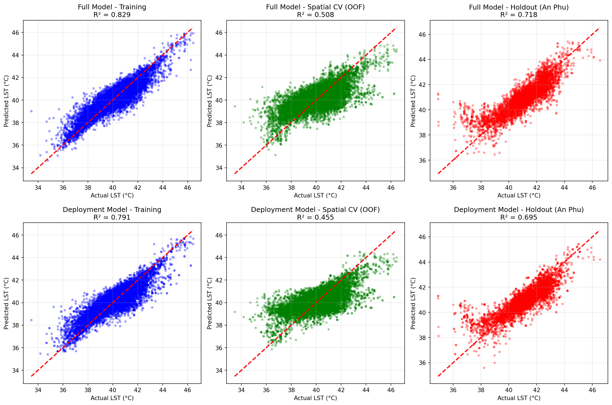

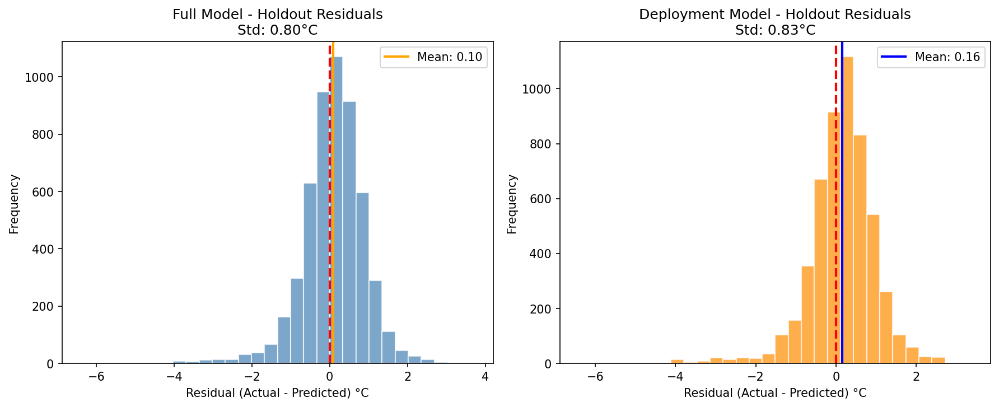

Model performance was evaluated using three complementary metrics: training set performance, spatial cross-validation (leave-one-ward-out), and holdout ward (An Phú) performance.

| Metric         | Full Model         | Deployment Model   |
|----------------|--------------------|--------------------|
| Features       | 18                 | 11                 |
| Training RMSE  | 0.6203             | 0.6844             |
| Training R²    | 0.8285             | 0.7913             |
| Spatial CV RMSE| 1.0510 ± 0.2898    | 1.1061 ± 0.2755    |
| Spatial CV R²  | 0.5079 ± 0.2757    | 0.4549 ± 0.2688    |
| Holdout RMSE   | 0.8093             | 0.8422             |
| Holdout R²     | 0.7180             | 0.6946             |
| Holdout MAE    | 0.5909             | 0.6134             |

: Model Performance Comparison

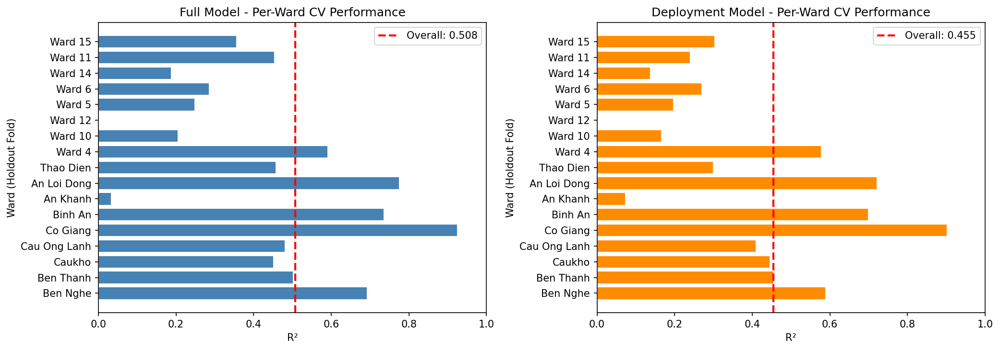

The spatial cross-validation reveals substantial inter-ward variability (± 0.27 R²), indicating that some wards are considerably harder to predict than others. The holdout ward (An Phú) achieved higher R² than the spatial CV average, suggesting it shares similar characteristics with the training wards.

## Overfitting Assessment

| Metric              | Full Model | Deployment Model |
|---------------------|------------|------------------|
| Training R²         | 0.8285     | 0.7913           |
| Spatial CV R²       | 0.5079     | 0.4549           |
| Holdout R²          | 0.7180     | 0.6946           |
| Train-Holdout Gap   | 0.1105     | 0.0967           |

: Overfitting Assessment

The train-holdout gap of approximately 0.10 indicates moderate but acceptable overfitting for a spatial prediction task. The larger train-CV gap (~0.32) reflects inter-ward heterogeneity rather than classical overfitting—different wards have different predictability based on their urban morphology.

## GSV Feature Contribution

The contribution of GSV-derived streetscape features was quantified by comparing the full model (with GSV) to the deployment model (raster-only):

| Metric                    | Improvement |
|---------------------------|-------------|
| Spatial CV R² Improvement | +0.0530     |
| Holdout R² Improvement    | +0.0234     |

: GSV Feature Contribution

GSV features provide modest but meaningful improvement, confirming that street-level imagery adds predictive value beyond satellite data alone.

## Feature Importance

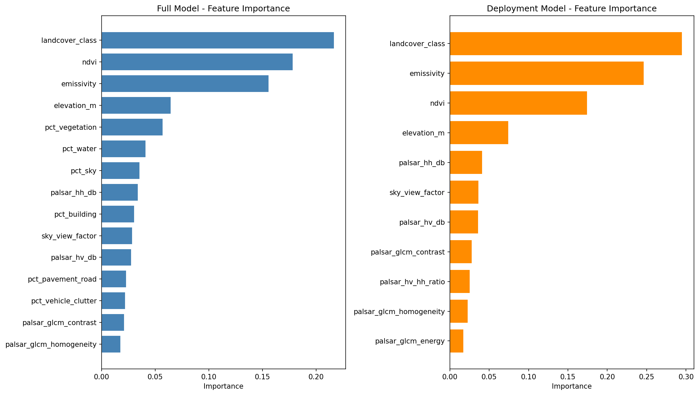

| **Feature**               | **Full Model** | **Deployment Model** |
|---------------------------|----------------|----------------------|
| landcover_class           | 0.2169         | 0.2953               |
| ndvi                      | 0.1787         | 0.1746               |
| emissivity                | 0.1560         | 0.2467               |
| elevation_m               | 0.0648         | 0.0746               |
| pct_vegetation            | 0.0572         | —                    |
| pct_water                 | 0.0413         | —                    |
| pct_sky                   | 0.0355         | —                    |
| palsar_hh_db              | 0.0342         | 0.0416               |
| pct_building              | 0.0305         | —                    |
| sky_view_factor           | 0.0289         | 0.0366               |

: Top 10 Feature Importance

The dominant predictors were consistent across both models. Landcover class, NDVI, and emissivity ranked highest, together accounting for over 55% of predictive power. In the full model, GSV-derived streetscape variables (vegetation, water, sky percentages) contributed additional explanatory signal, ranking within the top 10 features.

## Node Prediction Coverage

| Minimum | Mean    | Maximum | Standard Deviation |
|---------|---------|---------|--------------------|
| 35.44°C | 40.84°C | 46.28°C | 1.76°C             |

: LST Prediction Statistics

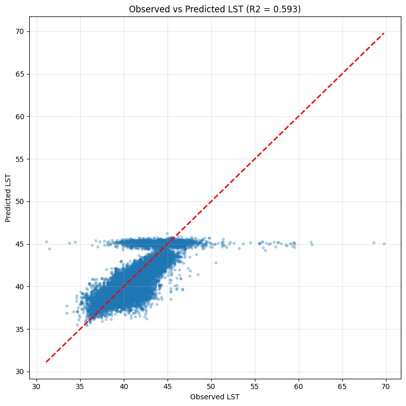

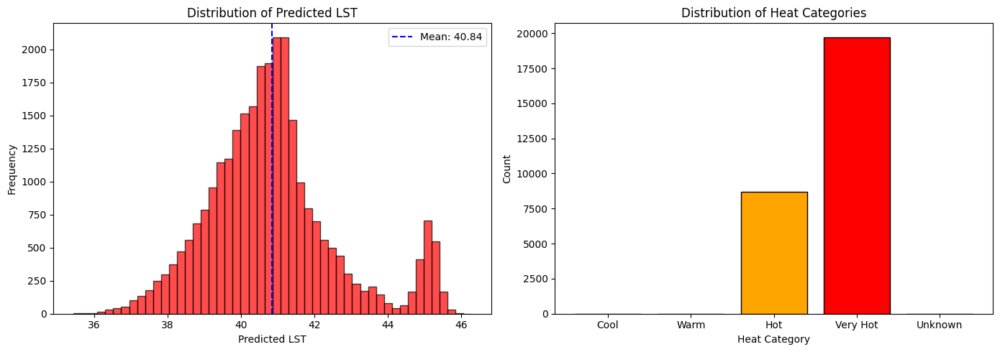

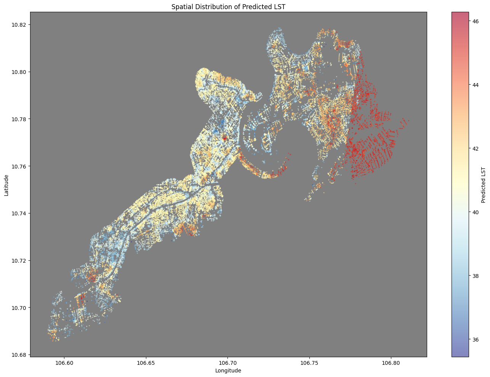

This mean-reverting behavior has critical implications for applying the model to environments outside the training distribution, particularly areas with significant open space, non-tree greenery like grass fields, or non-clustered buildings. The model was trained primarily on the complex street canyon geometry of HCMC's central districts. It may struggle to fully capture the cooling effect of large, continuous patches of greenery and open spaces because these structures were not the dominant features in the training data's morphology. Consequently, it is likely to over-predict the LST in these large, cool areas, pushing the prediction closer to the mean and failing to accurately capture the full range of low temperatures achievable in those settings.

## Routing Outcomes

The coolest route increases travel distance but reduces both mean and peak exposure, demonstrating tangible potential for heat-resilient mobility guidance. The hottest route identifies corridors of maximum heat exposure—priority candidates for infrastructure intervention.

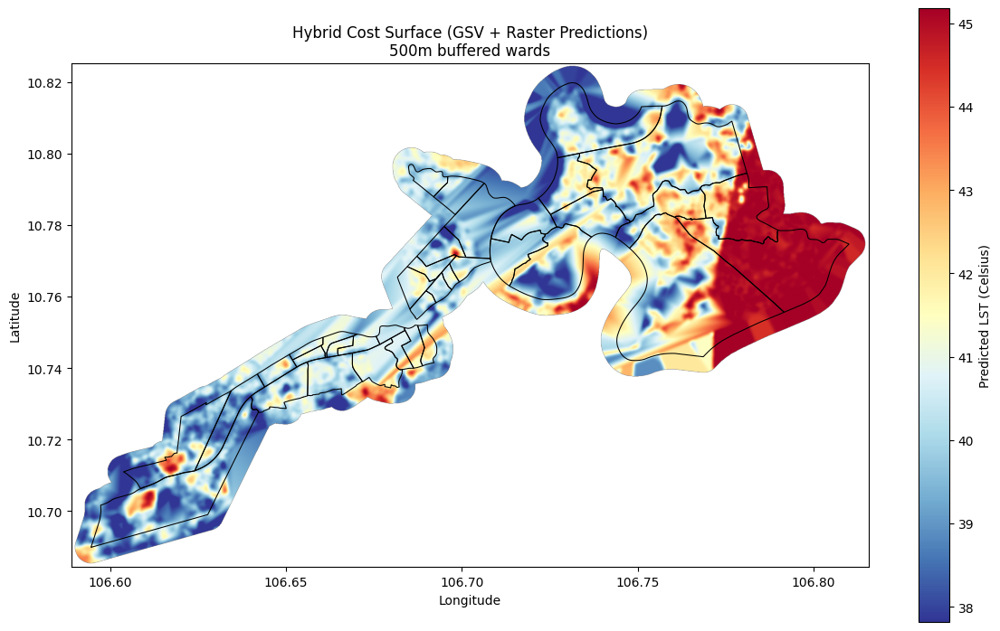

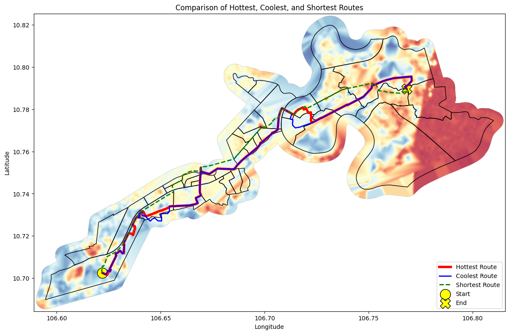

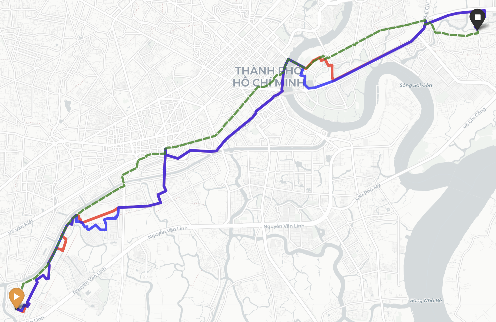

| Route    | Distance (km) | Average LST | Maximum LST |
|----------|---------------|-------------|-------------|
| Shortest | 22.00         | 40.63°C     | 45.41°C     |
| Coolest  | 27.83         | 40.20°C     | 43.95°C     |
| Hottest  | 27.38         | 40.40°C     | 43.95°C     |

: Routing Results

The coolest route adds 5.83 km (26.5% distance penalty) to reduce average temperature by 0.43°C. This trade-off highlights why infrastructure investment matters more than individual route choice—residents should not bear a 26% distance penalty to marginally reduce heat exposure.

# V. Discussion and Limitations

Hot Hẻm demonstrates a scalable approach for integrating human-scale streetscape morphology with city-scale remote sensing to operationalize pedestrian heat risk. The deployment model achieves R² of 0.69 on the held-out An Phú ward, with predictions typically within 0.61°C (MAE) of observed LST, demonstrating robust generalization to unseen areas. However, there are significant limitations for the future:

**Spatial Transferability:** Performance varies significantly by ward (CV std = ±0.27 R²). Some areas with unique urban morphology are harder to predict, and the model may underperform in wards that differ substantially from the training distribution (Middel et al., 2019).

**Temporal Mismatch:** GSV images were captured at various times over several years, while Landsat composites represent dry-season 2023–2025 maximum temperatures. Street conditions (e.g., tree canopy, construction) may have changed between GSV capture and satellite observation.

**Feature Redundancy:** The originally computed GVI, SVI, and BVI indices were identical to their corresponding superclass percentages (pct_vegetation, pct_sky, pct_building) and were removed from the final model to avoid redundancy.

**Sky View Factor Limitations:** The sky view factor derived from the 30m terrain DSM captures topographic effects but does not fully represent urban canyon geometry at the street level.

**Heat Category Calibration:** The current heat-category thresholds skew heavily toward "Hot / Very Hot," suggesting that categorical calibration (e.g., quantile-based or health-relevant thresholds) should be refined prior to policy-facing deployment.

# VI. Conclusion

This project delivers a reproducible, multi-scale GeoAI pipeline for heat-weighted pedestrian routing in Ho Chi Minh City. By combining GSV-derived segmentation indices with Landsat thermal variables, JAXA SAR structure, and DSM terrain context, the framework achieves strong predictive accuracy (holdout R² = 0.70, MAE = 0.6°C) and enables practical routing alternatives that identify heat exposure corridors.

The key insight is methodological: rather than helping individuals escape heat, the hottest route optimization identifies where pedestrians suffer most, providing municipalities with actionable data for infrastructure intervention. The 26% distance penalty imposed by the coolest route demonstrates that heat avoidance should not be framed as individual responsibility—it is a systemic infrastructure challenge requiring public investment. It should be noted that GSV imagery contains copyright restrictions forbidding their implementations in building applications, so granular streetscape imagery would need to be manually obtained or downloaded from open-source material.

Future extensions should include multi-ward holdout testing, threshold calibration using health-relevant cutoffs, multi-season or diurnal modeling, weather data, uncertainty-aware routing, and Meta’s tree canopy height data (Tolan et al., 2023), and Global Building Atlas’ 3D dataset (Zhu et al., 2025) to further strengthen real-world applicability.

# VII. References

Biljecki, F., & Ito, K. (2021). Street view imagery in urban analytics and GIS: A review. *Landscape and Urban Planning*, 215, 104217.

Boeing, G. (2017). OSMnx: New methods for acquiring, constructing, analyzing, and visualizing complex street networks. *Computers, Environment and Urban Systems*, 65, 126-139.

Chakraborty, T., Hsu, A., Manya, D., & Sheriff, G. (2019). Disproportionately higher exposure to urban heat in lower-income neighborhoods: a multi-city perspective. *Environmental Research Letters*, 14(10), 105003.

Chen, T., & Guestrin, C. (2016). XGBoost: A scalable tree boosting system. In *Proceedings of the 22nd ACM SIGKDD International Conference on Knowledge Discovery and Data Mining* (pp. 785-794).

Cheng, B., Misra, I., Schwing, A. G., Kirillov, A., & Girdhar, R. (2022). Masked-attention mask transformer for universal image segmentation. In *Proceedings of the IEEE/CVF conference on computer vision and pattern recognition* (pp. 1290-1299).

Dijkstra, E. W. (1959). A note on two problems in connexion with graphs. *Numerische Mathematik*, 1, 269-271.

Ho, H. C., Knudby, A., Sirovyak, P., Xu, Y., Hodul, M., & Henderson, S. B. (2014). Mapping maximum urban air temperature on hot summer days. *Remote Sensing of Environment*, 154, 38-45.

Kang, Y., Zhang, F., Gao, S., Lin, H., & Liu, Y. (2020). A review of urban physical environment sensing using street view imagery in public health studies. *Annals of GIS*, 26(3), 261-275.

Li, X., Zhang, C., Li, W., Ricard, R., Meng, Q., & Zhang, W. (2015). Assessing street-level urban greenery using Google Street View and a modified green view index. *Urban Forestry & Urban Greening*, 14(3), 675-685.

Middel, A., Lukasczyk, J., Zakrzewski, S., Arnold, M., & Maciejewski, R. (2019). Urban form and composition of street canyons: A human-centric big data and deep learning approach. *Landscape and Urban Planning*, 183, 122-132.

Neuhold, G., Ollmann, T., Rota Bulo, S., & Kontschieder, P. (2017). The Mapillary Vistas Dataset for Semantic Understanding of Street Scenes. In *International Conference on Computer Vision (ICCV)*.

Oke, T. R. (1982). The energetic basis of the urban heat island. *Quarterly Journal of the Royal Meteorological Society*, 108(455), 1-24.

Shimada, M., Itoh, T., Motooka, T., Watanabe, M., Shiraishi, T., Thapa, R., & PALSAR Project Team. (2014). New global forest/non-forest maps from ALOS PALSAR data (2007–2010). *Remote Sensing of Environment*, 155, 13-31.

Tolan, J., Yang, H.-I., Nosarzewski, B., Couairon, G., Vo, H., Brandt, J., Spore, J., Majumdar, S., Haziza, D., Vamaraju, J., Moutakanni, T., Bojanowski, P., Johns, T., White, B., Tiecke, T., & Couprie, C. (2023). Very high resolution canopy height maps from RGB imagery using self-supervised vision transformer and convolutional decoder trained on Aerial Lidar [Dataset]. Meta. https://dataforgood.facebook.com/dfg/tools/canopy-height-maps

United States Geological Survey (USGS). (2024). *Landsat 8-9 Operational Land Imagery (OLI) and Thermal Infrared Sensor (TIRS) Collection 2 Level-2 Data*.

Voogt, J. A., & Oke, T. R. (2003). Thermal remote sensing of urban climates. *Remote Sensing of Environment*, 86(3), 370-384.

Zhang, F., Zhou, B., Liu, L., Liu, Y., Fung, H. H., Lin, H., & Ratti, C. (2019). Measuring human perceptions of a large-scale urban region using machine learning. *Landscape and Urban Planning*, 180, 148-160.

Zhu, X. X., Chen, S., Zhang, F., Shi, Y., and Wang, Y.: GlobalBuildingAtlas: an open global and complete dataset of building polygons, heights and LoD1 3D models, *Earth Syst. Sci. Data*, 17, 6647–6668, https://doi.org/10.5194/essd-17-6647-2025, 2025.