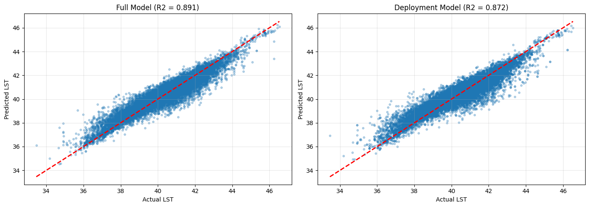

# Abstract

Hot Hẻm is a GeoAI workflow that estimates and operationalizes pedestrian heat exposure in Hồ Chí Minh City (HCMC), Việt Nam, colloquially known as Sài Gòn. This spatial data science pipeline combines Google Street View (GSV) imagery, semantic image segmentation, and remote sensing. Two XGBoost models are trained to predict land surface temperature (LST) using a GSV training dataset in selected administrative wards, known as phường, and are deployed in a patchwork manner across all OSMnx-derived pedestrian network nodes to enable heat-aware routing. This is a model that, when deployed, can provide a foundation for *pinpointing where* and further *understanding why* certain city corridors may experience disproportionately higher temperatures at an infrastructural scale.

# I. Introduction

Given that urban heat and other environmental injustices are widely recognized as being disproportionately felt, dangerous heat exposure will only continue to exacerbate with growing populations and current pollution trajectories. Extreme heat is heterogeneous and driven by both macro-scale morphologies (e.g. elevation, land cover, surface emissivity) and micro-scale streetscapes (e.g. building canyon effects, tree canopy, visible sky), many of which are influenced by local municipalities' regulations on the built environment and social structures.

Conventional thermal mapping often emphasizes satellite-derived patterns that could underrepresent pedestrian-scale experiences, and some existing literature notes shaded routes can significantly improve pedestrian comfort. However, there is lacking emphasis that the onus falls on local municipalities to provide resilient, cool, and green infrastructure—this is a byproduct communicated by shade-finding algorithms that present coolest routes. Regardless of intention, they present as alternatives rather than tools to assist with building solutions, implying health, wellbeing, and heat-stress mitigation is a choice among locals, and not a prevailing systemic and infrastructural issue that will worsen with global warming.

This project aims to fill these gaps by firstly, fusing street-level visual morphology with thermal and structural remote-sensing predictors, and secondly, by seeking the hottest routes as a government tool. This is where machine learning (ML) optimization can recommend routes *minimizing shade* and *maximizing sun exposure*, revealing the hottest paths as potential candidates for shaded infrastructure, future tree canopies, or further investigation, demonstrating how ML can help enhance urban resilience to extreme heat.

# II. Data and Study Area

## Pedestrian Network and Wards

A pedestrian network graph with a 500-meter buffer was extracted from Python's `osmnx` library, yielding 28,445 nodes and 74,710 edges for three administrative districts: District 1, District 2, and District 8. Due to API costs and keeping in mind computational efficiency, only six wards were selected as disparate GSV candidates, two from each district of interest: Bến Thành (2,424 nodes) and Co Giang (1,840 nodes) in District 1, An Khanh (1,119 nodes) and Thảo Điền (1,547) in District 2, and Phường 5 (2,346 nodes) and Phường 6 (2,013 nodes) from District 8.


## Street-Level Imagery

GSV samples generated 23,806 points from 500-meter buffered wards of interest at 50-meter intervals. Metadata contained 20,457 images, an unfortunate 14.07% decrease due to interruptions, but nonetheless providing sufficient density for training streetscape indeces and validating segmentation outputs within wards of interest.

## Remote Sensing Rasters

The satellite data was extracted from several different sources:

**Landsat 8 / 9 (30m resolution, dry months December thru April, 2023–2025)**

-   LST ST_B10 Band

-   Emissivity ST_EMIS Band

-   Red SR_B4 Band

-   Near Infrared (NIR) SR_B5 Band

-   QA_PIXEL Band

**JAXA LULC (10m resolution, 2025)**

-   Land Cover

**JAXA PALSAR-2 (ScanSAR, 50m resolution, 2025)**

-   HH Polarization

-   HV Polarization

-   Observation Date / Time

-   Local Incidence Angle

-   Mask / Flag

**ALSO World 2D DSM (30m resolution, 2025)**

-   Elevation

-   Mask

-   Stacking Number

# III. Methodologies

In the interest of computational efficiency, all notebooks and scripting were offloaded from local into cloud computing using Google's Colab. Combining only Landsat rasters into a composite was completed in ArcGIS v3.4.

## Image Segmentation and Superclass Mapping

GSV images were processed using a model trained on Southeast Asian cities, Mask2Former Mapillary Vistas (`facebook/mask2former-swin-large-mapillary-vistas-semantic`), accessed via Hugging Face with an API token. It contains 66 object categories for semantic segmentation primed for street-level scene analysis for complex urban cities like Sài Gòn.

GSV images were 640 x 640 pixel resolution, ideally, panoramic images would have been preferable, but due to cost restraints, the static imagery was made to dynamically alter the header to be front-facing.

To improve interpretability and stability for index construction, raw segmentation classes were remapped into seven superclasses:

| Mapping | Superclass               |
|---------|--------------------------|
| 0       | Other                    |
| 1       | Vegetation               |
| 2       | Sky                      |
| 3       | Building                 |
| 4       | Pavement / Road          |
| 5       | Water                    |
| 6       | Vehicle / Street Clutter |

: Superclass Mappings


## Engineering Indeces

The final merged superclass imagery was used to create predictive features:

**Green View Index (GVI):** Proportion of vegetation.

**Sky View Index (SVI):** Proportion of sky.

**Building View Index (BVI):** Proportion of building.

**Hardscape Index:** Combining building, pavement / road, and vehicle / clutter classes.


## Raster Extraction

The collection of Landsat rasters moved through the below workflow in this order:

1.  Create Mosaic Dataset (Data Management)
2.  Make Mosaic Layer (Data Management)
3.  Cell Statistics (Spatial Analyst)
4.  Raster Calculator (Spatial Analyst)
5.  Copy Raster (Data Management)
6.  Composite Bands (Data Management)

A mosaic dataset was created to combine and stitch together 64 scenes from 2023 thru 2025 during dry season months December thru April.

The different mosaic layers were isolated, with maximum LST and averages for other layers. This was to process individual cell statistics to convert DN raw values and re-scale, and raster calculations to calculate NDVI and alter LST from Kelvin to Celsius. Only the QA_PIXEL band was acquired through the 5th tool.

Two extraction products were used for the rasters, one for the GSV sample points and second for the entire network nodes. All raster values were extracted for all nodes except for LST, where 0.0037% of nodes were unaccounted for, decreasing from 28,437 to 28,332 nodes.

## Model Design and Training

Two XGBoost models were trained using the `xgboost` Python library, one as the full model including the rasters as well as the GSV features for maximum predictive power, and second as the shared model for real-world deployment using only the raster features.

``` python
# Landsat features: thermal and vegetation indices.
LANDSAT_FEATURES = [
    "ndvi",
    "emissivity"
]

# PALSAR features: radar backscatter and texture.
PALSAR_FEATURES = [
    "palsar_hh_db",
    "palsar_hv_db",
    "palsar_hv_hh_ratio",
    "palsar_glcm_contrast",
    "palsar_glcm_homogeneity",
    "palsar_glcm_energy"
]

# DSM features: elevation and sky view.
DSM_FEATURES = [
    "elevation_m",
    "sky_view_factor"
]

# Landcover features.
LANDCOVER_FEATURES = [
    "landcover_class"
]

# GSV segmentation features: visual indices from street imagery.
GSV_SEGMENTATION_FEATURES = [
    "pct_vegetation",
    "pct_water",
]

# GSV derived features: computed indices.
GSV_DERIVED_FEATURES = [
    "gvi",
    "svi",
    "bvi",
    "hardscape_index"
]

# Location features: administrative boundaries.
LOCATION_FEATURES = [
    "district",
    "ward"
]
```

The XGBoost parameters were carefully selected and to balance complexity, learning speed, and regularization to prevent overfitting while still capturing the complex, non-linear mechanisms that impact LST, and are as follows:

`random.seed(42)`

`n_estimators`: 500

`max_depth`: 6

`learning_rate`: 0.05

`subsample`: 0.8

`colsample_bytree`: 0.8

`min_child_weight`: 3

`reg_alpha`: 0.1

`reg_lambda`: 1.0

`random_state`: 42

`n_jobs`: -1

`early_stopping_rounds`: 50

## Node Prediction and Routing

A patchwork approach was pursued, using the GSV model to predict within wards of interest and the shared raster-only model to predict outside of those wards.

After generating predictions for network nodes a prediction raster was derived from them and interpolated to create a hybrid cost surface. The raster resolution was 0.0001 degrees and 2,266 x 1,409 pixel resolution clipped to the area of interest encompassing the districts and a Gaussian blur was applied to smooth out streak artifacts.

Dijkstra's algorithm was implemented, assigning heat edge costs by combining normalized length and temperature to support three route types with tunable heat penalty and reward parameters: shortest, coolest with a temperature penalty, and hottest with an inverted temperature penalty to reward.

``` python
# Heat weights.
for u, v, data in G_undirected.edges(data = True):
    avg_lst = data["avg_lst"]
    length  = data["length"]

    # Normalize temperature to [0, 1].
    temp_norm = (avg_lst - lst_min) / lst_range

    # Normalize length relative to mean edge length.
    length_norm = length / len_mean

    # Tune lambda.
    lambda_cool = 10.0 # How much to penalize heat.
    lambda_hot  = 10.0 # How much to reward heat.

    # Cool Cost: shorter + cooler (high temperature = high penalty).
    data["cool_cost"] = length_norm + lambda_cool * temp_norm

    # Hot Cost: shorter + hotter (invert temp_norm).
    data["hot_cost"] = length_norm + lambda_hot * (1.0 - temp_norm)
```

``` python
# Routing helpers.
def get_hottest_route(G, start, end):
    """Shortest-ish but biased toward hottest edges."""
    try:
        path = nx.dijkstra_path(G, start, end, weight = "hot_cost")
        cost = nx.dijkstra_path_length(G, start, end, weight = "hot_cost")
        dist = nx.path_weight(G, path, weight = "length")
        return path, cost, dist
    except nx.NetworkXNoPath:
        return None, None, None

def get_coolest_route(G, start, end):
    """Shortest-ish but biased toward coolest edges."""
    try:
        path = nx.dijkstra_path(G, start, end, weight = "cool_cost")
        cost = nx.dijkstra_path_length(G, start, end, weight = "cool_cost")
        dist = nx.path_weight(G, path, weight = "length")
        return path, cost, dist
    except nx.NetworkXNoPath:
        return None, None, None

def get_shortest_route(G, start, end):
    """
    Returns shortest walking path.
    """
    try:
        path = nx.shortest_path(G, start, end, weight = "length")
        dist = nx.path_weight(G, path, weight = "length")
        return path, dist
    except nx.NetworkXNoPath:
        return None, None
```

# IV. Results

## Model Performance

| Statistic | Value  | Error  |
|-----------|--------|--------|
| RMSE      | 0.7001 | 0.0115 |
| R²        | 0.7959 | 0.0089 |
| MAE       | 0.5106 | 0.0103 |

: Full Model Cross-Validation Results

| Statistic | Value  | Error  |
|-----------|--------|--------|
| RMSE      | 0.7117 | 0.0173 |
| R²        | 0.7892 | 0.0083 |
| MAE       | 0.5105 | 0.0141 |

: Shared Model Cross-Validation Results

The difference between the two models is marginal, with a 0.0116 change in RMSE, 0.0067 change in R², and 0.0001 change in MAE. The shared model has a slight degradation compared to the full model, suggesting that GSV provides micro-scale refinement.

## Feature Importance

| **Feature**     | **Importance** |
|-----------------|----------------|
| emissivity      | 0.2314         |
| ndvi            | 0.2167         |
| landcover_class | 0.1979         |
| elevation_m     | 0.0486         |
| pct_vegetation  | 0.0416         |
| svi             | 0.0359         |
| sky_view_factor | 0.0270         |
| pct_water       | 0.0256         |
| palsar_hh_db    | 0.0244         |
| gvi             | 0.0244         |

: Full Model Feature Importance

| **Feature**             | **Importance** |
|-------------------------|----------------|
| emissivity              | 0.2314         |
| landcover_class         | 0.2167         |
| ndvi                    | 0.1979         |
| elevation_m             | 0.0486         |
| sky_view_factor         | 0.0416         |
| palsar_hv_db            | 0.0359         |
| palsar_hh_db            | 0.0270         |
| palsar_glcm_contrast    | 0.0256         |
| palsar_hv_hh_ratio      | 0.0244         |
| palsar_glcm_homogeneity | 0.0244         |

: Shared Model Feature Importance

The dominant predictors were consistent across both models. Emissivity, NDVI, and land cover class ranked highest, followed by elevation and SAR-derived structure (HH/HV backscatter and GLCM texture). In the full model, streetscape variables (e.g. vegetation and sky-related measures) contributed additional explanatory signal.

## Node Prediction Coverage

| Minimum | Mean    | Maximum | Standard Deviation |
|---------|---------|---------|--------------------|
| 35.44°C | 40.84°C | 46.28°C | 1.76°C             |

: LST Prediction Statistics




When compared against nodes with extracted Landsat LST, performance was lower (RMSE 1.3127, R² 0.5929, MAE 0.8487), likely reflecting scale mismatch between point-linked training data and node-level evaluation plus spatial and sensor aggregation effects.

## Routing Outcomes

The coolest route increases travel distance but reduces both mean and peak exposure, demonstrating tangible potential for heat-resilient mobility guidance.


| Route    | Distance (km) | Average LST | Maximum LST |
|----------|---------------|-------------|-------------|
| Shortest | 22.00         | 40.63°C     | 45.41°C     |
| Coolest  | 27.83         | 40.20°C     | 43.95°C     |
| Hottest  | 27.38         | 40.40°C     | 43.95°C     |

: Routing Results

# V. Discussion and Limitations

Hot Hẻm demonstrates a scalable approach for integrating human-scale streetscape morphology with city-scale remote sensing to operationalize pedestrian heat risk. The small performance gap between full and deployment models suggests that the system remains robust even in areas with sparse GSV coverage.

Two limitations merit emphasis. First, temporal alignment between GSV acquisition and satellite composites may introduce noise in model relationships. Second, the current heat-category thresholds appear to skew heavily toward “Hot/Very Hot,” suggesting that categorical calibration (e.g., quantile-based or health-relevant thresholds) should be refined prior to policy-facing deployment.

# VI. Conclusion

This project delivers a reproducible, multi-scale GeoAI pipeline for heat-weighted pedestrian routing in Ho Chi Minh City. By combining GSV-derived segmentation indices with Landsat thermal variables, JAXA SAR structure, and DSM terrain context, the framework achieves strong predictive accuracy and enables practical routing alternatives that reduce heat exposure. Future extensions should include threshold calibration, multi-season modeling, and uncertainty-aware routing to further strengthen real-world applicability.